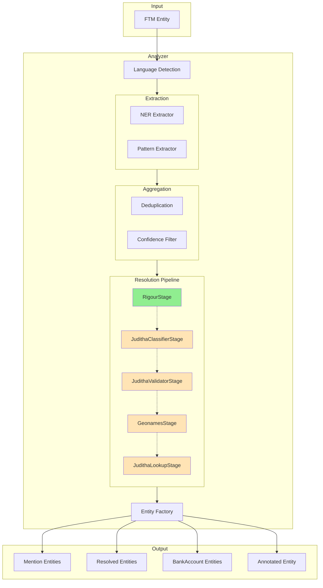
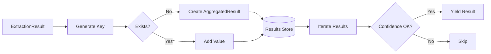
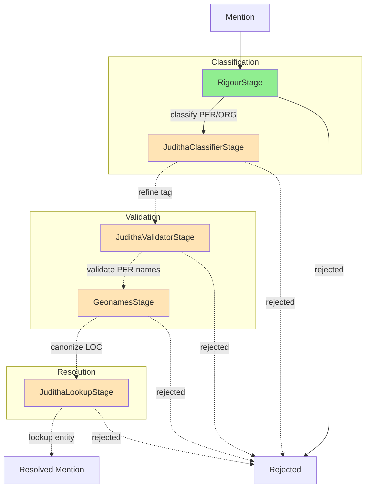
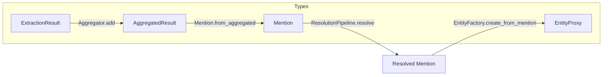

# Extraction Pipeline

This document describes the entity extraction pipeline in ftm-analyze.

## Overview

The pipeline processes FTM (FollowTheMoney) entities to extract structured information like named entities, patterns (emails, phones, IBANs), and resolves them against known datasets.



> **Legend:** Green = enabled by default, Orange = optional (disabled by default), Dashed lines = optional stages

## Pipeline Stages

### 1. Language Detection

Detects the language of text content using fastText. The detected languages are stored on the entity and used to select appropriate NER models.

### 2. Extraction

Two types of extractors run in parallel:

#### NER Extractors

Extract named entities (persons, organizations, locations) using one of:

| Engine | Description |
|--------|-------------|
| `spacy` | Default. Uses spaCy models with language-specific variants |
| `flair` | Uses Flair NER models |
| `bert` | Uses HuggingFace transformers (dslim/bert-base-NER) |
| `gliner` | Uses GLiNER zero-shot NER |

#### Pattern Extractor

Extracts structured patterns using regex and validation:

- **Emails** - Validated email addresses
- **Phones** - Phone numbers (via phonenumbers library)
- **IBANs** - International Bank Account Numbers (via schwifty)

### 3. Aggregation

The `Aggregator` combines extraction results:

1. **Deduplication** - Groups results by normalized key (using rigour name normalization for NER, FTM type cleaning for patterns)
2. **Confidence Filtering** - Optional filtering using a fastText classifier to reject "trash" extractions



### 4. Resolution Pipeline

A composable pipeline of stages that process mentions. Each stage can:

- Modify mention attributes (tag, values, schema)
- Reject mentions
- Pass through unchanged

> **Note:** By default, only `RigourStage` is enabled. All juditha and geonames stages require external services and must be explicitly enabled via configuration.



#### Stage Details

| Stage | Default | Purpose | Rejects When |
|-------|---------|---------|--------------|
| **Classification** | | | |
| `RigourStage` | **Enabled** | Fast heuristic classification using rigour name patterns. Detects person names (via name symbols) and org names (via org class symbols like Ltd, Inc). Cleans prefixes. | Never |
| `JudithaClassifierStage` | Disabled | ML-based refinement using juditha classifier. Can reclassify PER↔ORG. Requires juditha service. | Low confidence |
| **Validation** | | | |
| `JudithaValidatorStage` | Disabled | Validates entity names (PER) against known name token datasets. Requires juditha service. | Name validation fails |
| `GeonamesStage` | Disabled | Resolves location names (LOC) against geonames database. Sets canonical name and extracts country. Requires geonames data. | Location not found (optional) |
| **Resolution** | | | |
| `JudithaLookupStage` | Disabled | Looks up mentions in juditha entity store. Resolves to canonical forms and known entity IDs. Requires juditha service. | Never |

### 5. Entity Factory

Creates FTM entities from resolved mentions:

| Input | Output Entity Type |
|-------|-------------------|
| Resolved mention with schema | Person, Organization, etc. |
| Unresolved PER/ORG mention | Mention (with `detectedSchema`) |
| IBAN pattern | BankAccount |

### 6. Output

The pipeline yields:

1. **Mention entities** - Links between source document and detected names
2. **Resolved entities** - Person, Organization entities with canonical names
3. **BankAccount entities** - From IBAN extractions
4. **Annotated source entity** - Original entity with extracted properties and optional annotated text for Elasticsearch

## Data Flow



## Configuration

Pipeline behavior is controlled via environment variables:

| Variable | Default | Description | Enables Stage |
|----------|---------|-------------|---------------|
| `FTM_ANALYZE_NER_ENGINE` | `spacy` | NER engine: spacy, flair, bert, gliner | - |
| `FTM_ANALYZE_REFINE_MENTIONS` | `false` | Enable juditha ML classifier | `JudithaClassifierStage` |
| `FTM_ANALYZE_REFINE_LOCATIONS` | `false` | Enable geonames resolution | `GeonamesStage` |
| `FTM_ANALYZE_VALIDATE_NAMES` | `false` | Enable name validation | `JudithaValidatorStage` |
| `FTM_ANALYZE_RESOLVE_MENTIONS` | `false` | Enable juditha entity lookup | `JudithaLookupStage` |
| `FTM_ANALYZE_ANNOTATE` | `false` | Generate annotated text for Elasticsearch | - |

### Default Pipeline

With default settings, the pipeline runs:

1. Language detection
2. NER extraction (spaCy)
3. Pattern extraction
4. Aggregation with confidence filtering
5. Resolution with `RigourStage` only
6. Entity creation (Mention entities, BankAccounts)

### Full Pipeline

To enable all resolution stages:

```bash
export FTM_ANALYZE_REFINE_MENTIONS=true
export FTM_ANALYZE_REFINE_LOCATIONS=true
export FTM_ANALYZE_VALIDATE_NAMES=true
export FTM_ANALYZE_RESOLVE_MENTIONS=true
```

This requires running [juditha](https://github.com/dataresearchcenter/juditha) and having geonames data available.

## Tracing

Enable pipeline tracing for debugging:

```python
analyzer = Analyzer(entity, enable_tracing=True)
analyzer.feed(entity)
for result in analyzer.flush():
    pass

# Get trace summary
summary = analyzer.get_trace_summary()
```

The tracer collects statistics on:

- Extractions (accepted/rejected by source and tag)
- Aggregations (by tag)
- Resolutions (accepted/rejected by stage)
- Entity creation (by schema)
